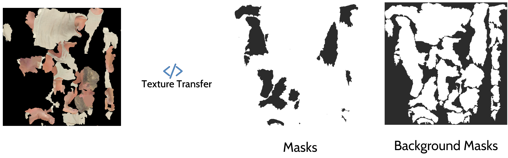

# TSCom-Net
Implementation for "TSCom-Net: Coarse-to-Fine 3D Textured Shape Completion Network", ECCVW 2022. The network architecture and its implemention is extended from [IF-Net](https://github.com/jchibane/if-net) and [IF-Net Texture](https://github.com/jchibane/if-net_texture).

[Paper](https://arxiv.org/abs/2208.08768)

[Dataset](https://cvi2.uni.lu/3dbodytexv2/)

[Pretrained Model](https://dropit.uni.lu/invitations?share=587f91de8c55309b3cda)

## Install

Install the conda environment

```
conda env create -f tscom-net.yml
conda activate tscom-net
```

Install the libraries needed by [IF-Net](https://github.com/jchibane/if-net) 

```
cd data_processing/libmesh/
python setup.py build_ext --inplace
cd ../libvoxelize/
python setup.py build_ext --inplace
cd ../..
```

(Optional) Temporarily adding the repository directory to your PYTHONPATH is recommended.
```
export PYTHONPATH=$path_to_tscom-net:$PATH
```

## Data Preparation I (For Section 3.1 of [TSCom-Net](https://arxiv.org/abs/2208.08768))

* Adjust the config (./config/SHARP2022/file_name.yml) file according to the dataset paths.
* The command below will with generate 3D voxels with occupancy values for the input textured 
   partial shapes.

	```bash
	$ python ./data_processing/convert_to_point_cloud.py ./config/SHARP2022/track1.yaml.
	``` 
* In the second step of data processing, points are sampled from ground-truth shape surfaces, 
  and their occupancies (1 if the points are on or inside the surface, 0 otherwise) are saved as 
  training data by running the following command

  ```bash
    $ python data_processing/boundary_sampling.py config/SHARP2022/track1.yaml.
  ```
* The training, testing and validation split is created with

    ```bash
    $ python data_processing/create_split.py config/SHARP2022/track1.yaml.
    ```

* The final pre-processed dataset structure is as the following.

    ```
    Challenge1/
        Track1-3DBodyTex.v2/
            track1_dataset/
                train/
                    scan-name/
                        --- scan-name_normalized.obj
                        --- scan-name_normalized.mtl
                        --- scan-name_normalized.png
                        --- scan-name_normalized_boundary_samples.npz
                        --- scan-name_normalized-partial-01.obj
                        --- scan-name_normalized-partial-01.mtl
                        --- scan-name_normalized-partial-01.png
                        --- scan-name_normalized-partial-01_voxelized_point_cloud.npz
                        ...
                        ...
                        --- scan-name_normalized-partial-n.obj
                        --- scan-name_normalized-partial-n.mtl
                        --- scan-name_normalized-partial-n.png
                        --- scan-name_normalized-partial-n_voxelized_point_cloud.npz
    ```
## Data Preparation II (For Section 3.2 of [TSCom-Net](https://arxiv.org/abs/2208.08768))
* * Put the predictions (the completed body shape with vertex colors) from joint-implicit network of TSCom-Net under the folder "data/<evaluation_EpochNumber>/".
* * Run the command ``` python run_on_eval.py```
    *  The above script calls a propietry binary executable (``` "./run_transfer.sh %s %s %s %s" % (path, recon_path, path, out_path)``` at [Line No. 141](https://gitlab.uni.lu/cvi2/Artec-cluster/tscom-net/-/blob/master/texture_transfer/run_on_eval.py#L141)) to transfer 2D partial texture to the completed body shape. This executable is not made open source, nevertheless any ray-tracing based texture transfer method can be used.  See the following example

    

    

## Training and Inference

* Train the TSCom-Net (for partial shape + texture completion).

    ```
    python train.py ./config/SHARP2022/track1_T2_train.yaml
    ``` 

*  Use the following command for inference/generation of complete shape, using trained model.
    
    ```
    python generate.py ./config/SHARP2022/track1_(T1|T2)_infer.yaml
    ```

## Texture Inpainting 

The code for the texture inpainting can be found [here](texture_inpaint/README.md).

## Citation
If you use or extend any part of this code for your research, 
please consider citing our paper below. 
The source code of TSCOM-Net is licensed under [MIT License](LICENSE) and many of its parts are
reused from [IF-Net](https://github.com/jchibane/if-net). 

    @article{karadeniz2022tscom,
        title={TSCom-Net: Coarse-to-Fine 3D Textured Shape Completion Network},
        author={Karadeniz, Ahmet Serdar and Ali, Sk Aziz and Kacem, Anis and Dupont, Elona 
        and Aouada, Djamila},
        journal={arXiv preprint arXiv:2208.08768},
        year={2022}
    }

    @inproceedings{chibane20ifnet,
        title = {Implicit Functions in Feature Space for 3D Shape Reconstruction and Completion},
        author = {Chibane, Julian and Alldieck, Thiemo and Pons-Moll, Gerard},
        booktitle = {{IEEE} Conference on Computer Vision and Pattern Recognition (CVPR)},
        month = {jun},
        organization = {{IEEE}},
        year = {2020},
    }

    @inproceedings{chibane2020ifnet_texture,
        title = {Implicit Feature Networks for Texture Completion from Partial 3D Data},
        author = {Chibane, Julian and Pons-Moll, Gerard},
        booktitle = {European Conference on Computer Vision (ECCV) Workshops},
        month = {August},
        organization = {{Springer}},
        year = {2020},
    }
    
